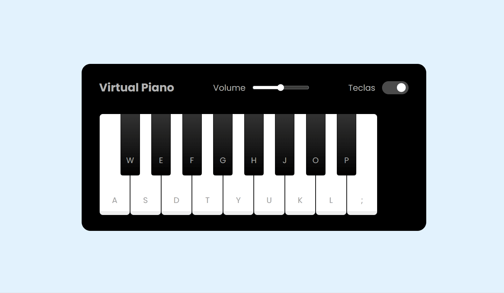

# 🎹 Piano Virtual com JavaScript
Um simulador de piano interativo e responsivo, construído com HTML, CSS e JavaScript. Este projeto permite que os usuários toquem notas musicais usando o mouse ou o teclado do computador, oferecendo uma experiência musical diretamente no navegador.

## 🎬 Demonstração

## ✨ Sobre o Projeto
O Piano Virtual foi desenvolvido como um exercício prático para aprofundar conhecimentos em manipulação de eventos e áudio na web. O objetivo era criar uma interface limpa e funcional que mapeasse as teclas do teclado do computador para as notas do piano, além de incluir controles essenciais como ajuste de volume e a opção de visualizar os atalhos.

## 🚀 Funcionalidades
* **Tocabilidade Dupla:** As notas podem ser tocadas tanto com cliques do mouse quanto pressionando as teclas correspondentes no teclado.

* **Feedback Visual:** As teclas do piano são visualmente pressionadas quando ativadas.

* **Controle de Volume:** Um slider permite ajustar o volume dos sons do piano.

* **Visualização de Teclas:** Um botão de alternância (toggle) permite mostrar ou ocultar as letras correspondentes às teclas do teclado.

* **Design Moderno:** Interface minimalista e agradável.

## 🛠️ Tecnologias Utilizadas
* **HTML5:** Para a estrutura do piano e dos controles.

* **CSS3:** Para a estilização do teclado, dos controles (slider, toggle) e das animações de pressionamento das teclas.

* **JavaScript:** Para toda a lógica e interatividade:

  * Manipulação de eventos de click (mouse) e keydown (teclado).

  * Manipulação de Áudio com elementos <audio> para tocar as notas.

  * Mapeamento das teclas do teclado para as notas musicais correspondentes.

  * Lógica para os controles de volume e visualização.

## 📚 Objetivos de Aprendizagem
Praticar o manuseio de múltiplos eventos de entrada do usuário.

Integrar e controlar a reprodução de áudio em uma aplicação web.

Mapear ações do teclado a funcionalidades específicas da interface.

Desenvolver componentes de UI personalizados, como sliders e toggles, com JavaScript.

Aprimorar habilidades de estilização com CSS para criar uma interface fiel a um objeto do mundo real.

Feito com ❤️ por Ester Costa.

___

# 🎹 Virtual Piano with JavaScript
An interactive and responsive piano simulator built with HTML, CSS, and JavaScript. This project allows users to play musical notes using either their mouse or computer keyboard, providing a musical experience directly in the browser.

## 🎬 Demonstration

## ✨ About the Project
The Virtual Piano was developed as a practical exercise to deepen knowledge in web-based event and audio handling. The goal was to create a clean and functional interface that maps computer keyboard keys to piano notes, while also including essential controls like volume adjustment and an option to display key shortcuts.

## 🚀 Features
* **Dual Playability:** Notes can be played with both mouse clicks and by pressing the corresponding keys on the keyboard.

* **Visual Feedback:** The piano keys are visually pressed down when activated.

* **Volume Control:** A slider allows users to adjust the piano's volume.

* **Key Display Toggle:** A toggle switch allows users to show or hide the letters corresponding to the keyboard shortcuts.

* **Modern Design:** A minimalist and pleasant user interface.

## 🛠️ Technologies Used
* **HTML5:** For the structure of the piano and its controls.

* **CSS3:** For styling the keyboard, controls (slider, toggle), and key press animations.

* **JavaScript:** For all the logic and interactivity:

  * Handling click (mouse) and keydown (keyboard) events.

  * Audio handling with <audio> elements to play the notes.

  * Mapping keyboard keys to their corresponding musical notes.

  * Logic for the volume and key display controls.

## 📚 Learning Objectives
Practice handling multiple types of user input events.

Integrate and control audio playback in a web application.

Map keyboard actions to specific interface functionalities.

Develop custom UI components like sliders and toggles with JavaScript.

Enhance CSS skills to create an interface that is faithful to a real-world object.

Made with ❤️ by Ester Costa.
